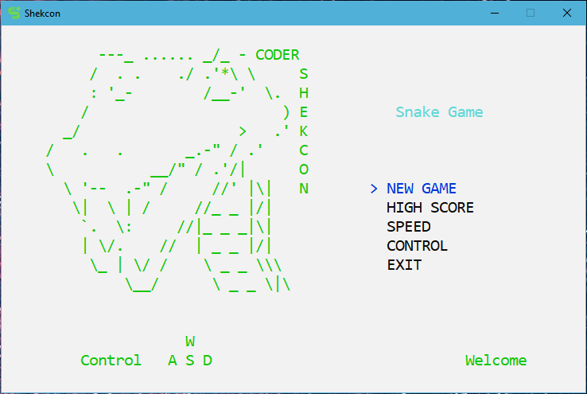
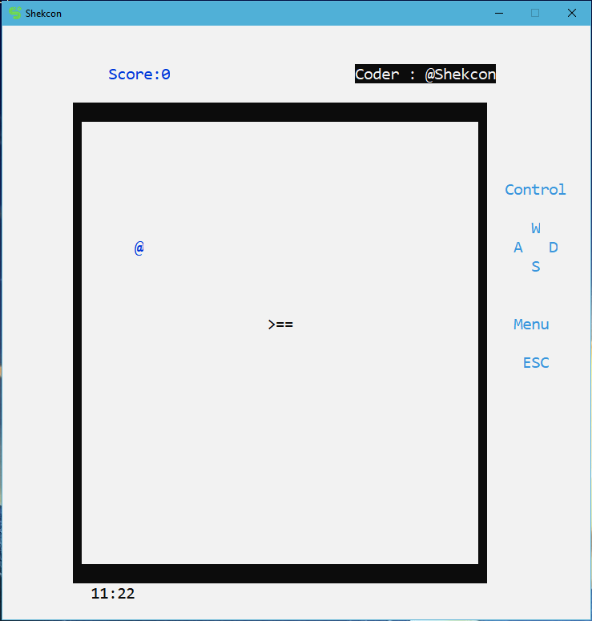
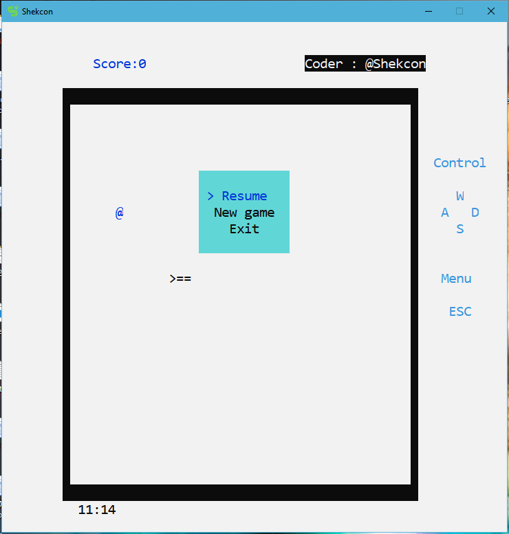

## Game-Snake
#### Snake game build in Visual Studio 2015 using C++ on console

### In ver 0.2:
 - Have better welcome console
 - Menu: play only
 - Control(like FPS) : a: left ; d: right ; w: up ; s: down 
 - Menu: like control above
 
### In ver 0.3 : 
 - Remove scrollbar
 - Add title game
 - Color for map and food ,snake's location when playing
 - Play more easy than previou version.

### In ver 0.4 : 
 - Add sound in game but need more config from user
 
### In ver 0.5 : 
 - Able to change Speed of snake , 
 - Exit game.
 - Go back menu game after you have been died.
 - Some bug hidden when playing.

### In ver 0.6: 
 - Fix bug more peformance
 - Change speed
 - Save setting, 
 - Save data
 - Ranking score

### In ver 0.7: 
 - Add menu in play game included: Resume, New game and Exit.

## Screenshots:

### [Download](https://drive.google.com/file/d/1-BAAcIrclNSvcqqxFGbtKF6YgpZfGTt8/view?usp=sharing)
